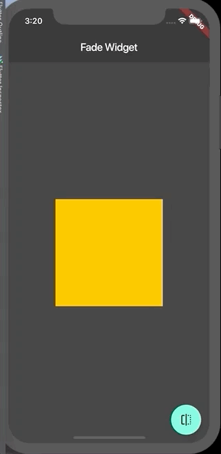

# FadeWidget

Como desarrolladores, necesitamos mostrar o esconder elementos en pantalla, esto lo podemos hacer animando la opacidad para crear una experiencia más suave.

En Flutter esto lo podemos hacer usando el Widget AnimatedOpacity.

Cuando tenemos el cuadro que va a realizar el fade necesitamos animarlos, para esto necesitamos saver si el cuadro es visible o onvisible, para poder realizar esto utilizamos un StatefulWidget, este es una clase que crea un objeto State, este almacena los datos sobre nuestra app y nos da una forma para actualizar nuestro datos. Cuando actualizamos nuestros datos, podemos preguntarle a FLutter que reconstruya nuesta UI con los cambios realizados.

Para construir el StatefulWidget, necesitamos crear dos clases: un StatefulWidget y la correspondiente clase State.

Para hacer el fade al presionar el boton, realizamos el cambio usando setState, el cual es un metodo en la clase State, esto le permite a Flutter saber que necesita reconstruir el Widget.

